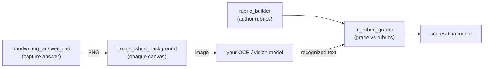

<div align="center">

# 🎓 Flutter Grading Toolkit

### Reusable Dart & Flutter packages for building AI-assisted grading and assessment apps.

[](https://github.com/makieali/flutter-grading-toolkit/actions/workflows/ci.yml)
[](./LICENSE)
[](https://dart.dev)
[](https://flutter.dev)

</div>

---

These packages were extracted, cleaned up, and decoupled from a real AI autograder
app (teachers author rubrics → students handwrite answers → an LLM grades them).
Each one does **one thing well**, has **no backend coupling**, ships with tests,
and is independently publishable to [pub.dev](https://pub.dev).

## 📦 Packages

| Package | pub.dev | What it does | Platform |
|---|---|---|---|
| [**ai_rubric_grader**](packages/ai_rubric_grader) | [](https://pub.dev/packages/ai_rubric_grader) | LLM-agnostic, rubric-based grading. Questions + rubrics + answers → structured, **clamped** scores with rationale. Bring your own LLM. | Pure Dart |
| [**rubric_builder**](packages/rubric_builder) | [](https://pub.dev/packages/rubric_builder) | A widget to author weighted rubrics with a live points total, backed by a clean, controller-free, serializable model. | Flutter |
| [**handwriting_answer_pad**](packages/handwriting_answer_pad) | [](https://pub.dev/packages/handwriting_answer_pad) | A handwriting capture pad (undo/redo/clear) with a **pluggable recognizer** hook — bring your own OCR / vision model. | Flutter |
| [**image_white_background**](packages/image_white_background) | [](https://pub.dev/packages/image_white_background) | Composite a transparent image onto a solid background before sending it to OCR / vision models. | Flutter |

## 🧩 How they fit together



Each package is usable **on its own** — the diagram just shows the full pipeline
the toolkit was distilled from.

## 🔐 Design principles

- **No secrets, no backend coupling.** The grader and the pad take an injected
  client / recognizer — you decide where the API key lives (hint: **server-side**,
  never in a client app).
- **Immutable, serializable models.** No `TextEditingController`s buried in data
  classes, no leaks.
- **Tested.** 33 tests across the suite; every package passes `dart/flutter
  analyze` clean and `pub publish --dry-run` with **0 warnings**.

## 🚀 Install

All four packages are published on [pub.dev](https://pub.dev). Add the ones you
need to your `pubspec.yaml`:

```yaml
dependencies:
  ai_rubric_grader: ^0.1.0        # pure Dart
  rubric_builder: ^0.1.0          # Flutter
  handwriting_answer_pad: ^0.1.0  # Flutter
  image_white_background: ^0.1.0  # Flutter
```

Or grab a single one with `dart pub add ai_rubric_grader` /
`flutter pub add rubric_builder`. See each package's README for full usage.

## 🛠️ Development

This is a plain monorepo — each package under `packages/` is self-contained.

```bash
cd packages/ai_rubric_grader && dart pub get && dart test
cd packages/rubric_builder    && flutter pub get && flutter test
```

CI runs analyze + tests for every package on each push.

## 📄 License

[MIT](./LICENSE) © 2026 Muhammad Ali
